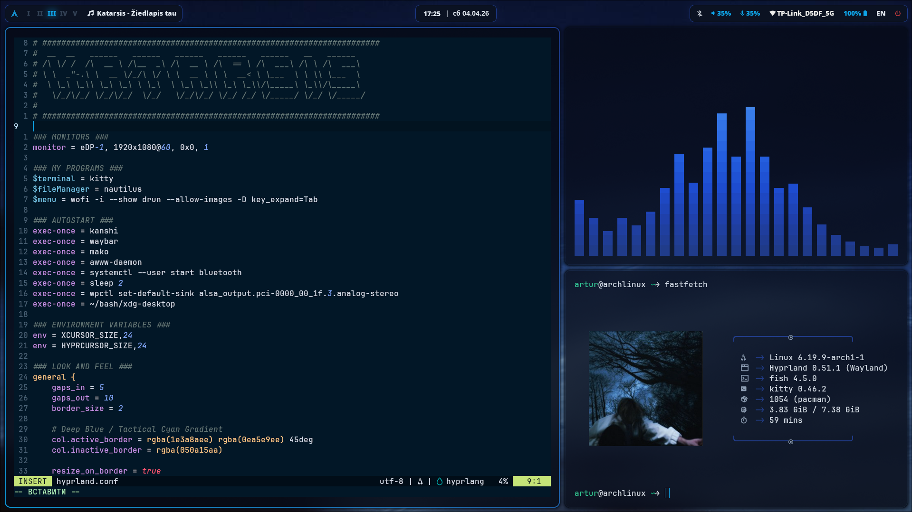
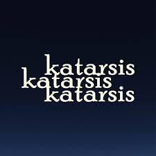

# 🌌 Katarsis Configs

A high-performance, minimalist Arch Linux setup (Rice) built on the **Hyprland** compositor. Focused on a deep blue aesthetic, productivity, and a clean "Katarsis" state of mind.

<br>
<p align="center">
  
</p>

### 🌊 Concept ###
**Katarsis** (Catharsis) represents the process of purification and finding clarity through minimalism. This setup is a blend of Ukrainian soul and global aesthetic standards, featuring full support for both English and Ukrainian workflows.

### ### Software Stack ###
* **WM:** [Hyprland](https://hyprland.org/) (Wayland)
* **Bar:** [Waybar](https://github.com/Alexays/Waybar)
* **Terminal:** [Kitty](https://sw.kovidgoyal.net/kitty/)
* **Shell:** [Fish](https://fishshell.com/)
* **Editor:** [Neovim](https://neovim.io/) (Night Owl theme)
* **Wallpaper Manager:** [wlchanger](https://github.com/subarash-ii/wlchanger) (External tool used for dynamic backgrounds)
* **Launcher:** [Wofi](https://hg.sr.ht/~scoopta/wofi) / [Rofi](https://github.com/davatorium/rofi)
* **Visualizer:** [Cava](https://github.com/karlstav/cava)
* **Notifications:** [Mako](https://github.com/emersion/mako)

### ### Key Features ###
* **Visual Harmony:** Unified "Deep Night" palette across all UI elements.
* **Bi-lingual Logic:** Fully optimized for English and Ukrainian users.
* **Clean Code:** All configuration files are strictly organized with `### Header ###` blocks.
* **Performance:** Extremely low resource usage with a focus on speed.

### ### Installation ###

> [!WARNING]  
> Always backup your existing configs before overwriting!

1. **Clone the repo:**
```bash
git clone https://github.com/Pan-Artur/katarsis-configs.git
cd katarsis-configs
```

2. **Deploy configs:**
```bash
# This will copy all folders to your .config directory
cp -r * ~/.config/
```

3. **Install Fonts:** Make sure you have **JetBrainsMono Nerd Font installed** for the icons and text to render correctly.

### 🎶 Inspiration & Soundtrack ###
<br>
<table>
<tr>
<td>

This project is deeply inspired by the music and energy of the band Katarsis. Their sound resonates through every line of code and every shade of blue in this setup. Listen: [Katarsis on Spotify](https://open.spotify.com/artist/34H2dyYLUMMtI1gynkGGY1?si=6F4Dkn5ZQ2CAGhM3QIkYMw)

</td>
<td align="right">



</td>
</tr>
</table>

### ### Contact & Community ###

[](https://t.me/ArchiPank)
[](https://github.com/Pan-Artur)

* Created by **Pankovets Artur**.
* Proud member of the **Arch Linux** community.

Clean your system. Clean your mind. Listen to Katarsis.
